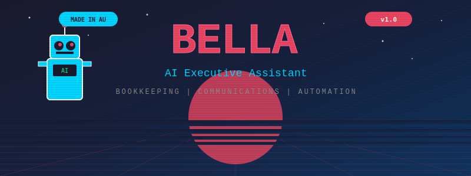

<p align="center">
  
</p>

<p align="center">
  <strong>Your 24/7 AI-powered business assistant that handles everything from customer emails to tax calculations</strong>
</p>

<p align="center">
  
  
  
  
</p>

---

# Bella - Complete Business Automation Framework

> **Meet Bella:** An AI assistant that runs your entire business. Handles customer communication, bookkeeping, invoices, marketing, scheduling, and more. Never sleeps. Never complains. Knows Australian tax law better than your accountant.

## What is Bella?

Bella is an **intelligent business assistant** built specifically for small businesses in Australia. She's powered by AI (Google Gemini, Claude, GPT) and connects to all your business tools through secure APIs.

Think of Bella as your:
- 📧 **Email Manager** - Reads, writes, and responds to customer emails
- 💰 **Bookkeeper** - Records income/expenses, calculates GST, prepares BAS
- 📱 **Communication Hub** - Sends SMS, WhatsApp messages, and makes phone calls
- 📊 **Accountant** - Tracks payments, creates invoices, generates financial reports
- 📅 **Scheduler** - Manages your calendar, sends booking confirmations
- 📣 **Marketing Manager** - Posts to Instagram, Facebook, LinkedIn
- 🎯 **Sales Assistant** - Finds leads, sends cold outreach emails/calls

---

## How Does Bella Work?

```
┌─────────────────────────────────────────────────────────────────┐
│  YOU (Business Owner)                                           │
│  "Bella, send invoice to Sarah for $380"                        │
│  "Show me this month's profit"                                  │
│  "Post our latest clean to Instagram"                           │
└────────────────────────┬────────────────────────────────────────┘
                         │
                         ▼
┌─────────────────────────────────────────────────────────────────┐
│  BELLA (AI Brain - Gemini 3 Flash)                              │
│  • Understands natural language                                 │
│  • Remembers your business context                              │
│  • Decides which tools to use                                   │
│  • Executes multiple tasks automatically                        │
└────────────────────────┬────────────────────────────────────────┘
                         │
                         ▼
┌─────────────────────────────────────────────────────────────────┐
│  MCP SERVERS (Bella's Tools)                                    │
│  ┌──────────┬──────────┬──────────┬──────────┬────────────┐    │
│  │  Google  │  Square  │ Twilio   │  Meta    │ Accounting │    │
│  │  Gmail   │ Payments │  SMS     │ Instagram│   GST/BAS  │    │
│  │  Sheets  │ Invoices │  Voice   │ Facebook │  Expenses  │    │
│  │ Calendar │          │          │ LinkedIn │            │    │
│  └──────────┴──────────┴──────────┴──────────┴────────────┘    │
└────────────────────────┬────────────────────────────────────────┘
                         │
                         ▼
┌─────────────────────────────────────────────────────────────────┐
│  EXTERNAL SERVICES (The APIs Bella Uses)                        │
│  • Gmail - Send/receive emails                                  │
│  • Google Sheets - Store records                                │
│  • Square - Create invoices & payment links                     │
│  • Twilio - Send SMS & make phone calls                         │
│  • WhatsApp Business - Message customers                        │
│  • Facebook/Instagram - Post content                            │
│  • ElevenLabs - Generate voice messages                         │
└─────────────────────────────────────────────────────────────────┘
```

---

## What Can Bella Do? (Complete Feature List)

### 1. Customer Communication 📧📱

| Feature | What It Does | Example |
|---------|-------------|---------|
| **Gmail** | Send, read, search, and reply to emails | "Send quote email to john@example.com" |
| **SMS** | Send text messages via Twilio | "Send booking confirmation to 0412345678" |
| **WhatsApp** | Send WhatsApp Business messages | "Send payment reminder via WhatsApp to Sarah" |
| **Voice Calls** | Make AI-powered phone calls with text-to-speech | "Call property managers with our pitch" |
| **Voice Generation** | Create professional voice messages using ElevenLabs | "Generate voice message for voicemail" |

**Templates Built-In:**
- Booking confirmations
- Payment reminders
- Quote emails
- Review requests
- Follow-up messages

### 2. Bookkeeping & Accounting 💰📊

| Feature | What It Does | Example |
|---------|-------------|---------|
| **Income Recording** | Log money you've earned | "Record $380 income from Sarah Chen" |
| **Expense Recording** | Track money you've spent | "Add expense: $45 at Bunnings for supplies" |
| **GST Calculation** | Automatic Australian GST (Total ÷ 11) | "Calculate GST on $110" → "$10 GST, $100 ex-GST" |
| **BAS Preparation** | Quarterly Business Activity Statement | "Prepare my BAS for this quarter" |
| **Profit & Loss** | Generate P&L reports | "Show me profit and loss this month" |
| **Superannuation** | Calculate 11.5% super on wages | "Calculate super on $2000 wage" |
| **Expense Categories** | ATO-compliant expense tracking | Auto-categorizes: Supplies, Fuel, Marketing, etc. |
| **Financial Reports** | Monthly/quarterly/yearly summaries | "Show me Q1 financial summary" |

**Australian Tax Features:**
- ✅ GST-inclusive and exclusive calculations
- ✅ BAS worksheets (G1, G10, G11 totals)
- ✅ Tax-deductible expense identification
- ✅ Financial year reporting (July-June)
- ✅ $18,200 tax-free threshold tracking

### 3. Invoicing & Payments 💳

| Feature | What It Does | Example |
|---------|-------------|---------|
| **Create Invoices** | Square invoices with payment links | "Create invoice for Sarah: $380 for 2BR clean" |
| **Payment Links** | Shareable payment URLs | "Generate payment link for $150" |
| **Payment Tracking** | Monitor paid/unpaid invoices | "Show me unpaid invoices" |
| **Payment Reminders** | Auto-remind overdue clients | "Send payment reminder to overdue clients" |
| **Customer Management** | Track customer payment history | "Find customer by email" |

### 4. Scheduling & Calendar 📅

| Feature | What It Does | Example |
|---------|-------------|---------|
| **View Calendar** | Check your Google Calendar | "What's on my calendar tomorrow?" |
| **Create Events** | Add bookings and appointments | "Add booking: Sam's clean on Feb 5 at 10am" |
| **Check Availability** | See free time slots | "Am I free on Thursday afternoon?" |
| **Booking Confirmations** | Auto-send confirmation messages | Sends SMS/WhatsApp when booking created |
| **24h Reminders** | Pre-appointment reminder messages | Auto-sends day before appointment |

### 5. Marketing & Social Media 📣

| Feature | What It Does | Example |
|---------|-------------|---------|
| **Instagram Posts** | Share photos, carousels, stories | "Post this before/after to Instagram" |
| **Facebook Posts** | Business page posting | "Share this to Facebook page" |
| **LinkedIn Posts** | Professional content sharing | "Post about our growth on LinkedIn" |
| **Content Generation** | AI-written captions and posts | "Write an Instagram caption for this clean" |
| **Hashtag Optimization** | Relevant hashtag suggestions | Auto-adds #CleaningServices #Sydney etc. |

### 6. Lead Generation & Sales 🎯

| Feature | What It Does | Example |
|---------|-------------|---------|
| **Google Maps Scraping** | Find local businesses (property managers, etc.) | "Find property managers in Liverpool NSW" |
| **Web Research** | Extract contact details from websites | "Get email addresses from these websites" |
| **Lead Database** | Store and organize leads | Tracks: name, email, phone, company, status |
| **Cold Email Campaigns** | Honest, research-backed outreach | "Send cold email to 20 property managers" |
| **SMS Campaigns** | Text message outreach | "Send intro SMS to new leads" |
| **Voice Call Campaigns** | AI-powered cold calls | "Call leads with Grok-style pitch" |
| **Follow-up Sequences** | Automated follow-up timing | Auto-follows up after 3 days |
| **Outreach Logging** | Track all contact attempts | Logs every email/SMS/call in Google Sheets |

**Built-In Outreach Templates:**
- Bella Honest (radically transparent cold email)
- Property Manager pitch
- Airbnb host offer
- Childcare center cleaning
- Aged care facility cleaning
- NDIS provider cleaning

### 7. Business Intelligence 📈

| Feature | What It Does | Example |
|---------|-------------|---------|
| **Financial Dashboard** | Real-time profit/loss view | Auto-calculates from Google Sheets |
| **Customer Insights** | Track repeat customers & debts | "Who owes me money?" |
| **Revenue Trends** | Monthly income tracking | "Compare this month vs last month" |
| **Expense Analysis** | Category-wise spending breakdown | "Where is my money going?" |
| **Cash Flow** | Incoming vs outgoing money | "Show me cash flow this quarter" |

### 8. Automation & Workflows 🤖

| Feature | What It Does | Example |
|---------|-------------|---------|
| **Email Auto-Reply** | Respond to common enquiries | Auto-quotes based on email content |
| **Payment Receipts** | Auto-send thank you after payment | Triggered when Square payment received |
| **Review Requests** | Auto-request Google reviews | Sent 1 day after job completion |
| **Expiry Tracking** | Track pending payments | Weekly report of overdue invoices |
| **Voice Message Queue** | Batch voice message generation | Create 10 voicemails at once |

---

## Installation (Step-by-Step for Beginners)

### Prerequisites (What You Need Before Starting)

1. **A Computer** - Mac, Windows, or Linux
2. **Internet Connection** - For downloading and API access
3. **Python 3.10 or newer** - [Download here](https://www.python.org/downloads/)
4. **API Keys** - You'll need accounts for the services you want to use (we'll help you get these)

### Quick Install (Copy to Your Desktop)

**Option 1: One-Command Install (Mac/Linux)**

Open Terminal and run:

```bash
cd ~/Desktop && \
git clone https://github.com/SamDev1303/Botproject.git bella && \
cd bella && \
python3 -m venv .venv && \
source .venv/bin/activate && \
pip install mcp fastmcp && \
echo "✅ Bella installed successfully!"
```

**Option 2: Manual Install (Step-by-Step)**

1. **Download Bella:**
   - Go to: https://github.com/SamDev1303/Botproject
   - Click the green "Code" button
   - Click "Download ZIP"
   - Unzip to your Desktop
   - Rename folder to "bella"

2. **Open Terminal/Command Prompt:**
   - **Mac:** Open "Terminal" from Applications
   - **Windows:** Open "Command Prompt" or "PowerShell"

3. **Navigate to Bella folder:**
   ```bash
   cd ~/Desktop/bella
   ```

4. **Create virtual environment:**
   ```bash
   python3 -m venv .venv
   ```

5. **Activate virtual environment:**

   **Mac/Linux:**
   ```bash
   source .venv/bin/activate
   ```

   **Windows:**
   ```bash
   .venv\Scripts\activate
   ```

6. **Install Bella:**
   ```bash
   pip install mcp fastmcp
   ```

---

## Configuration (Setting Up Your API Keys)

### Step 1: Create Your Environment File

1. **Copy the example file:**
   ```bash
   cp .env.example ~/.clawdbot/.env
   ```

2. **Edit the file:**
   - **Mac:** `open ~/.clawdbot/.env` (opens in TextEdit)
   - **Windows:** `notepad %USERPROFILE%\.clawdbot\.env`

### Step 2: Get Your API Keys

You don't need ALL of these - only get keys for services you want to use:

#### 🔧 **Required for Basic Bella** (Start Here)

| Service | What For | How to Get | Free? |
|---------|----------|------------|-------|
| **Google OAuth** | Gmail, Sheets, Calendar | [Google Cloud Console](https://console.cloud.google.com) | ✅ Yes |
| **Google Gemini** | Bella's AI brain | [Google AI Studio](https://aistudio.google.com) | ✅ Yes |

#### 💰 **For Payments & Invoicing**

| Service | What For | How to Get | Free? |
|---------|----------|------------|-------|
| **Square** | Invoices, payment links | [Square Developer](https://developer.squareup.com) | ✅ Free plan |

#### 📱 **For Communication**

| Service | What For | How to Get | Free? |
|---------|----------|------------|-------|
| **Twilio** | SMS & voice calls | [Twilio Console](https://www.twilio.com/console) | 💵 Paid (trial available) |
| **Meta Business** | WhatsApp, Instagram, Facebook | [Meta for Developers](https://developers.facebook.com) | ✅ Free |

#### 🤖 **For Advanced Features**

| Service | What For | How to Get | Free? |
|---------|----------|------------|-------|
| **ElevenLabs** | Voice generation | [ElevenLabs](https://elevenlabs.io) | ✅ Free tier |
| **Brave Search** | Web research | [Brave Search API](https://brave.com/search/api/) | ✅ Free tier |
| **Apify** | Web scraping | [Apify Console](https://console.apify.com) | ✅ Free tier |

### Step 3: Configure Each Service

#### Google (Gmail, Sheets, Calendar)

1. Go to [Google Cloud Console](https://console.cloud.google.com)
2. Create new project: "Bella AI Assistant"
3. Enable APIs:
   - Gmail API
   - Google Sheets API
   - Google Calendar API
4. Create OAuth 2.0 credentials
5. Download `credentials.json`
6. Run OAuth setup:
   ```bash
   python3 mcp/setup_google_oauth.py
   ```
7. Copy the tokens to your `.env` file

#### Square (Payments)

1. Go to [Square Developer Dashboard](https://developer.squareup.com/apps)
2. Create new application: "Bella Payments"
3. Generate Access Token
4. Copy to `.env`:
   ```env
   SQUARE_ACCESS_TOKEN=your_token_here
   SQUARE_APPLICATION_ID=your_app_id_here
   SQUARE_ENVIRONMENT=production
   ```

#### Twilio (SMS/Calls)

1. Sign up at [Twilio](https://www.twilio.com/try-twilio)
2. Get free trial credits
3. Find your credentials in Console
4. Copy to `.env`:
   ```env
   TWILIO_ACCOUNT_SID=your_sid_here
   TWILIO_AUTH_TOKEN=your_token_here
   TWILIO_PHONE_NUMBER=+1234567890
   ```

---

## Running Bella

### Via Telegram Bot (Recommended)

1. **Create Telegram Bot:**
   - Message [@BotFather](https://t.me/botfather) on Telegram
   - Send `/newbot`
   - Follow instructions
   - Copy your bot token to `.env`

2. **Start Bella's Gateway:**
   ```bash
   cd ~/Desktop/bella
   source .venv/bin/activate
   python3 gateway.py
   ```

3. **Talk to Bella:**
   - Open Telegram
   - Find your bot
   - Send: "Hello Bella!"

### Via Claude Desktop App

1. **Install Claude Desktop**
2. **Configure MCP servers** in `claude_desktop_config.json`:
   ```json
   {
     "mcpServers": {
       "google": {
         "command": "python3",
         "args": ["/Users/you/Desktop/bella/mcp/google_server.py"]
       },
       "square": {
         "command": "python3",
         "args": ["/Users/you/Desktop/bella/mcp/square_server.py"]
       },
       "accounting": {
         "command": "python3",
         "args": ["/Users/you/Desktop/bella/mcp/accounting_server.py"]
       }
     }
   }
   ```

3. **Restart Claude Desktop**
4. **Bella's tools are now available!**

---

## Usage Examples (Real Business Scenarios)

### Example 1: New Booking Received

**You say:**
```
"New booking: Sarah Chen, 2BR end of lease clean at 45 Smith St Liverpool,
Feb 5 at 10am, phone 0412345678, $380"
```

**Bella does:**
1. ✅ Creates Google Calendar event
2. ✅ Sends SMS booking confirmation to Sarah
3. ✅ Records $380 income in bookkeeping (GST-inclusive)
4. ✅ Creates Square invoice
5. ✅ Sets reminder for 24 hours before

### Example 2: Monthly Bookkeeping

**You say:**
```
"Record today's expenses:
- $45.50 at Bunnings for cleaning supplies
- $65 for fuel
- $120 for advertising"
```

**Bella does:**
1. ✅ Logs each expense to Google Sheets
2. ✅ Calculates GST on each ($4.14 + $5.91 + $10.91)
3. ✅ Categorizes automatically (Supplies, Motor Vehicle, Marketing)
4. ✅ Updates running profit/loss

**You say:**
```
"Show me this month's profit"
```

**Bella responds:**
```
📊 Financial Summary - February 2026

Income: $14,214.42
Expenses: $1,540.88
Net Profit: $12,673.54

GST Collected: $1,292.22
GST Paid: $140.08
GST Owing: $1,152.14

Top Expenses:
• Stock/Materials: $645.50
• Motor Vehicle: $425.00
• Marketing: $270.38
```

### Example 3: End of Quarter BAS

**You say:**
```
"Prepare my BAS for Q2 2026"
```

**Bella generates:**
```
📋 BAS Worksheet - Q2 2026 (Jan-Mar)

G1 (Total Sales): $42,350.00
GST on Sales: $3,850.00

G10 (Capital Purchases): $0.00
G11 (Non-Capital Purchases): $4,521.00
GST Credits: $411.00

GST Owing: $3,439.00

Due Date: April 28, 2026

✅ Full report exported to Google Sheets
```

### Example 4: Social Media Marketing

**You say:**
```
"Post this before/after photo to Instagram with a caption about
our bond cleaning guarantee"
```

**Bella does:**
1. ✅ Generates engaging caption with AI
2. ✅ Adds relevant hashtags (#EndOfLeaseCleaning #Sydney #BondCleaning)
3. ✅ Posts to Instagram Business account
4. ✅ Logs post in activity tracker

**Caption Bella wrote:**
```
From "will I lose my bond?" to "spotless handover" 😮✨

This 2BR apartment in Liverpool got the full Bond-Back Guarantee
treatment. Oven: pristine. Carpets: like new. Walls: flawless.

Our clients get 100% of their bond back. Every. Single. Time.

End of lease stress? Not anymore.

📞 0406 764 585
🌐 cleanupbros.com.au

#CleanUpBros #EndOfLeaseCleaning #BondCleaning #SydneyCleaning
#Liverpool #WesternSydney #BondBack #ProfessionalCleaning
```

### Example 5: Lead Generation & Outreach

**You say:**
```
"Find 20 property managers in Parramatta and send them my honest pitch email"
```

**Bella does:**
1. ✅ Searches Google Maps for "property managers Parramatta"
2. ✅ Extracts company names, emails, phone numbers
3. ✅ Saves leads to database with status "new"
4. ✅ Sends personalized cold emails using "Bella Honest" template
5. ✅ Logs all outreach to Google Sheets
6. ✅ Schedules follow-up for 3 days later

**Sample email sent:**
```
Subject: Cold email alert - but hear me out

Hey [Name],

This is a cold email. I know. You know. Let's not pretend otherwise.

But here's the thing: I'm not blasting this to 10,000 people hoping
someone bites.

I specifically looked up [Company], saw you handle property management
in Parramatta, and thought - these people probably deal with dodgy
cleaners who ghost them before bond inspections.

That's our whole thing. End of lease. Bond-back guaranteed. No drama.

If you've already got a cleaner you trust, respect. Delete this.

If not, I'm Hafsah from Clean Up Bros. We've done 500+ cleans this year.
One number: 0406 764 585.

No pressure. Just putting it out there.

- Hafsah
Clean Up Bros

P.S. This email was researched by Bella, our AI assistant built by
Shamal using Claude Code. She found you. I wrote this. Real human here.
```

### Example 6: Payment Follow-Up

**You say:**
```
"Who owes me money?"
```

**Bella responds:**
```
💰 Outstanding Payments

1. Claudia Alz
   Amount: $320.00
   Days Overdue: 45
   Last Contact: Dec 15, 2025
   Status: ⚠️ OVERDUE

2. Meshach Ephraim Care
   Amount: $3,750.00
   Paid: $2,000.00
   Remaining: $1,750.00
   Status: ⏳ PAYMENT PLAN

Total Owed: $2,070.00
```

**You say:**
```
"Send payment reminder to Claudia"
```

**Bella sends SMS:**
```
Hi Claudia,

Friendly reminder that payment of $320.00 for your end of lease
clean is now 45 days overdue.

Pay online: square.link/cleanupbros
Bank: Clean Up Bros, BSB: 062-000, Acc: 1234567

Questions? Call 0406 764 585

Thanks!
- Clean Up Bros
```

---

## Advanced Features

### Voice Call Campaigns

Bella can make AI-powered phone calls with two styles:

**1. Professional Style** (Traditional business call)
```python
cold_outreach_call(
    to="+61412345678",
    business_name="ABC Property Management",
    contact_name="Sarah"
)
```

**2. Grok Style** (Fast, punchy, Grok AI personality)
```python
cold_outreach_call_grok(
    to="+61412345678",
    business_name="ABC Property Management",
    contact_name="Sarah"
)
```

**Grok-style script example:**
```
Is this Sarah? Perfect. Cold call. I know. 15 seconds max.

You're at ABC Property Management. You deal with cleaners.
Some good. Most aren't.

I'm Hafsah. Clean Up Bros. End of lease. Zero bond failures. Ever.

Quick note - don't call this number back. It's automated.

Real number: 0406 764 585. That's 0406 764 585.

Found by Bella, our AI. Built by Shamal. I'm the human.

Later.
```

### Video Generation

Create viral marketing videos with AI:

```python
generate_viral_ad(
    script="Our cleaners don't just clean. They transform spaces.",
    duration=15
)
```

### Expense Auto-Categorization

Bella automatically categorizes expenses based on vendor and description:

| Expense | Auto Category |
|---------|---------------|
| "Bunnings - cleaning supplies" | Stock/Materials |
| "Shell petrol" | Motor Vehicle - Fuel |
| "Facebook Ads" | Marketing |
| "Office Works - printer paper" | Office Supplies |
| "Electrician - office repair" | Repairs & Maintenance |

---

## Security & Privacy

### What Bella Does NOT Store

- ❌ Your API keys (they stay in `.env` on your computer)
- ❌ Customer credit card numbers
- ❌ Sensitive personal data
- ❌ Passwords

### What Bella DOES Store

- ✅ Business transactions in Google Sheets (your own sheet)
- ✅ Lead information in local database
- ✅ Outreach logs for tracking
- ✅ Session memory for context

### Best Practices

1. **Never share your `.env` file**
2. **Use environment-specific credentials** (sandbox vs production)
3. **Regularly review API access logs**
4. **Enable 2FA on all service accounts**
5. **Backup your Google Sheets monthly**

---

## Troubleshooting

### Common Issues

**Problem: "ModuleNotFoundError: No module named 'mcp'"**

Solution:
```bash
source .venv/bin/activate  # Activate virtual environment first
pip install mcp fastmcp
```

**Problem: "Google API authentication failed"**

Solution:
```bash
# Re-run OAuth setup
python3 mcp/setup_google_oauth.py

# Copy new tokens to .env file
```

**Problem: "Square API error 401 Unauthorized"**

Solution:
- Check your `SQUARE_ACCESS_TOKEN` is correct
- Verify `SQUARE_ENVIRONMENT` matches your token (production vs sandbox)

**Problem: "Twilio SMS not sending"**

Solution:
- Verify phone number includes country code (+61 for Australia)
- Check Twilio account balance
- Ensure phone number is verified (for trial accounts)

**Problem: "Bella doesn't remember context"**

Solution:
- Check `memory/` folder exists
- Verify write permissions on folder
- Restart Bella's gateway

---

## MCP Server Reference

### All Available Servers

| Server | File | Primary Tools | Status |
|--------|------|---------------|--------|
| Google | `google_server.py` | gmail, sheets, calendar, drive | ✅ Active |
| Square | `square_server.py` | invoices, payments, customers | ✅ Active |
| Accounting | `accounting_server.py` | income, expenses, gst, bas | ✅ Active |
| Twilio | `twilio_server.py` | sms, voice calls | ✅ Active |
| WhatsApp | `whatsapp_server.py` | whatsapp messages | ✅ Active |
| Meta | `meta_server.py` | instagram, facebook posts | ✅ Active |
| LinkedIn | `linkedin_server.py` | linkedin posts | ✅ Active |
| ElevenLabs | `elevenlabs_server.py` | voice generation | ✅ Active |
| Brave Search | `brave_server.py` | web search | ✅ Active |
| Apify | `apify_server.py` | web scraping | ✅ Active |
| Cold Outreach | `coldoutreach_server.py` | lead generation, campaigns | ✅ Active |
| Kie | `kie_server.py` | video generation | ✅ Active |

### Server Dependencies

```bash
# Core dependencies (required for all servers)
pip install mcp fastmcp

# For specific servers:
pip install google-auth google-auth-oauthlib google-auth-httplib2  # Google
pip install squareup  # Square (optional, uses urllib by default)
pip install twilio  # Twilio (optional, uses urllib by default)
pip install elevenlabs  # ElevenLabs voice
```

---

## Contributing

We welcome contributions! Here's how:

### Reporting Bugs

1. Check [existing issues](https://github.com/SamDev1303/Botproject/issues)
2. Create new issue with:
   - Clear description
   - Steps to reproduce
   - Expected vs actual behavior
   - Your environment (OS, Python version)

### Adding Features

1. Fork the repository
2. Create feature branch: `git checkout -b feature/amazing-feature`
3. Make changes
4. Add tests (if applicable)
5. Commit: `git commit -m "Add amazing feature"`
6. Push: `git push origin feature/amazing-feature`
7. Create Pull Request

### Code Style

- Follow PEP 8 for Python code
- Add docstrings to all functions
- Include type hints where possible
- Keep functions under 50 lines

---

## Roadmap

### Current Status (v1.0)
- ✅ All 12 MCP servers functional
- ✅ Australian tax compliance
- ✅ Multi-channel communication
- ✅ Lead generation & outreach
- ✅ Telegram bot interface

### Coming Soon (v1.1)
- 🔄 Web dashboard UI
- 🔄 Multi-business support
- 🔄 Advanced reporting
- 🔄 Automated testing suite

### Future (v2.0)
- 📅 AI-powered scheduling optimization
- 📅 Predictive cash flow analysis
- 📅 Multi-language support
- 📅 Mobile app

---

## Credits & Acknowledgments

**Built by:**
- Hafsah Nuzhat (Clean Up Bros, Sydney)
- Shamal (Developer)
- Claude Code (AI Development Assistant)

**Powered by:**
- [MCP (Model Context Protocol)](https://modelcontextprotocol.io) - Tool integration framework
- [FastMCP](https://github.com/jlowin/fastmcp) - MCP server framework
- [Google Gemini](https://ai.google.dev) - AI brain
- [Claude](https://claude.ai) - AI development
- [Google APIs](https://developers.google.com) - Gmail, Sheets, Calendar
- [Square API](https://developer.squareup.com) - Payments & invoicing
- [Twilio](https://www.twilio.com) - SMS & voice
- [Meta Business](https://developers.facebook.com) - Social media
- [ElevenLabs](https://elevenlabs.io) - Voice generation
- [Brave Search](https://brave.com/search/api/) - Web search
- [Apify](https://apify.com) - Web scraping

---

## License

MIT License - see [LICENSE](LICENSE) file for details.

You are free to:
- ✅ Use commercially
- ✅ Modify
- ✅ Distribute
- ✅ Private use

**Attribution appreciated but not required.**

---

## Support

Need help? Here's how to get it:

### Documentation
- 📖 [Full Documentation](https://github.com/SamDev1303/Botproject/wiki)
- 📖 [API Reference](https://github.com/SamDev1303/Botproject/wiki/API-Reference)
- 📖 [Video Tutorials](https://github.com/SamDev1303/Botproject/wiki/Tutorials)

### Community
- 💬 [GitHub Discussions](https://github.com/SamDev1303/Botproject/discussions)
- 🐛 [Report Issues](https://github.com/SamDev1303/Botproject/issues)
- 📧 Email: cleanupbros.au@gmail.com

### Professional Support
- For enterprise deployments, customization, or training: cleanupbros.au@gmail.com

---

## FAQ

**Q: Is Bella really free?**
A: Bella's code is free (MIT license). You pay for the third-party APIs you use (Google, Twilio, etc.). Many have free tiers.

**Q: Can I use Bella for my business?**
A: Yes! Bella is designed for small businesses. Works for any service business (cleaning, plumbing, landscaping, etc.).

**Q: Do I need coding experience?**
A: No! Just follow the installation guide. Basic terminal/command line knowledge helpful but not required.

**Q: Is my data safe?**
A: Yes. All data stays in YOUR Google Sheets and YOUR API accounts. Bella doesn't send data to external servers.

**Q: Can Bella handle multiple businesses?**
A: Currently designed for one business per install. Multi-business support coming in v1.1.

**Q: What if I don't use all the features?**
A: That's fine! Only activate the MCP servers you need. You don't need to configure services you won't use.

**Q: Can I customize Bella's responses?**
A: Yes! Edit the templates in each MCP server file. Bella's personality is defined in `IDENTITY.md`.

**Q: Does Bella work outside Australia?**
A: Yes, but the accounting module is Australian-specific (GST, BAS). You'd need to modify it for other tax systems.

**Q: How do I update Bella?**
A: `git pull` in the Bella folder to get latest updates from GitHub.

**Q: Can I sell services using Bella?**
A: Yes! The MIT license allows commercial use. You can even resell Bella-based services.

---

<p align="center">
  <strong>Made with ❤️ in Sydney, Australia</strong>
</p>

<p align="center">
  <em>Bella: Because your business deserves an assistant that works as hard as you do.</em>
</p>
